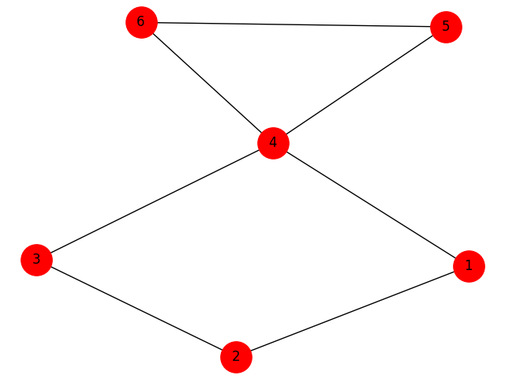

## Installation
Make sure you have [Pipenv](https://github.com/pypa/pipenv#installation) and execute:
```shell
$ pipenv install 
```

## Usage

```shell
$ pipenv shell
$ python main.py
```

## Prints





## Contributing
PRs are welcome, if you have any questions don't be afraid to open an issue.
