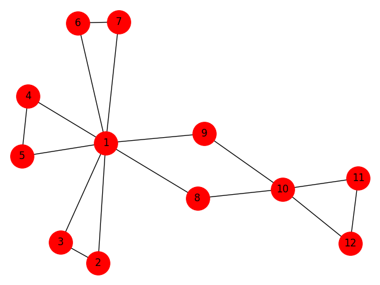

## Grafos - Ciclo Euleriano

### Integrantes do projeto:

* [Felipe Nathan Welter](https://github.com/felipenwelter)
* [Vitor Emanuel Batista](https://github.com/vitorebatista)

### Instalação
Necessário ter [Pipenv](https://github.com/pypa/pipenv#installation) e executar:
```shell
$ pipenv install 
```

### Utilização

```shell
$ pipenv shell
$ python main.py
```

### Ideia do algoritmo de Hierholzer

A idéia básica do algoritmo de Hierholzer é uma construção passo-a-passo do ciclo Euleriano por meio da conexão de subciclos. O início se dá em um vértice qualquer e segue para um vértice adjacente ainda não visitado, repetindo esse procedimento até que se retorne ao nó inicial, o que produz um primeiro ciclo no grafo. Caso cubra todos as arestas, se trata do próprio ciclo Euleriano e o algoritmo pode ser finalizado, caso contrário seleciona, entre os vértices do atual ciclo, um que ainda possua uma aresta que leve para um vértice não visitado, permitindo que se monte um novo subciclo a partir do primeiro, que então são mesclados. Se o ciclo estendido incluir todas as arestas, o algoritmo estará concluído.

### Funções implementadas

#### import_file

Importa um arquivo .graph com a estrutura de um grafo. Na primeira linha devem estar descritos todos os vértices, separados por vírgula e, a cada linha que segue, uma aresta configurada pela definição dos seus dois vértices (não direcionado).

*Complexidade da implementação: O(|A|) + [O(|A|) * O(|v|)] = O(|A|) * O(|v|) sendo A o número de arestas e v o número de vértices do grafo. A função percorre todas as arestas definidas no arquivo .graph, cuja complexidade resultante é O(|A|) e ao final executa a chamada da função __create_adjacency_list() que percorre todas as arestas (O(|A|))para montar uma lista de adjacências, que internamente realiza busca indexada em todos os vértices (O(|v|)).*

#### is_connected

Tem por objetivo verificar se todos os vértices estão conectados, premissa para identificar a existência de um ciclo euleriano. Internamente realiza uma busca em profundidade (__depth_search) e vai marcando cada vértice como visitado. Ao final realiza uma contagem de vértices não visitados para identificar se o grafo é conexo.

*Complexidade da implementação (__depth_search): O(|A|) * O(|V|) sendo `V` o número de vértices do grafo e `A` o número de arestas. A função realiza uma busca em profundidade (__depth_search) que percorre para cada vértice a sua lista de adjacências - uma vez no sentido v1 para v2 e outra no sentido v2 para v1, o que tem complexidade O(|A|). Para cada iteração realiza ainda uma busca na lista de vértices visitados, uma lista que tem o mesmo tamanho do número de vértices, resultando em uma complexidade O(|A|) * O(|V|).*

*Complexidade da implementação (is_connected): O(|A|) * O(|V|) sendo `V` o número de vértices do grafo e `A` o número de arestas. Realiza a busca em profundidade e uma busca por vértices não visitados com complexidade O(|v|).*

#### is_all_pair

Verifica se o vértices tem grau par, ou seja, se o número de arestas de cada vértice é par, sendo esse um requisito para identificar se o grafo possui ciclo euleriano.

*Complexidade da implementação: O(|v|), pois para cada vértice identifica o tamanho da lista de adjacências e verifica o módulo dois para identificar se é ou não par, portanto tem complexidade relativa ao número de vértices O(|v|).*

#### euler_cycle

Realiza a montagem de um ciclo euleriano a partir de um vértice inicial, um caminho que visita cada aresta uma vez, terminando no ponto de partida. A montagem do ciclo utiliza como base o algoritmo de Hierholzer, que realiza a busca em profundidade na intenção de montar subciclos e, a partir de vértices desse subciclo, monta novos subciclos e os agrega ao ciclo euleriano. Exemplificando de forma simples, um subciclo 1-2-3-4-1 cujo vértice 4 tem conexão para outros vértices 4-5-6-4 seria redefinido pela mescla desses dois subciclos, o que resultaria em um caminho euleriano 1-2-3-[4-5-6-4]-1, como se pode observar no exemplo 4.graph.

*Complexidade da implementação (__get_next_vertex_with_unvisited_edge): O(|v| * |A|^2). Essa implementação se utiliza da lista de vértices O(|v|) que compõem o caminho euleriano em construção e para cada vértice percorre a lista de arestas adjacentes O(|A|) para encontrar algum vértice que ainda não tenha sido visitado. Considerando que ao percorrer cada aresta da lista de arestas também realiza uma busca em todas as arestas O(|Aˆ2|), a complexidade resultante é O(|v| * |A|^2).*

*Complexidade da implementação (__get_next_vertex_index): O(|Aˆ2|). Retorna o próximo vértice que pode visitar a partir de um vértice dado. Para isso percorre a lista de adjacências do vértice O(|A|) e verifica se a aresta já foi visitada O(|A|)*

*Complexidade da implementação (euler_cycle): # O(|v|*|A|^2). Sua complexidade é dominada assintoticamente pela complexidade da função __get_next_vertex_with_unvisited_edge().*

### Considerações

A implementação utiliza uma classe para realizar o controle do grafo, sendo que vértices e arestas são definidos como objetos do tipo lista encadeada. O controle de visitas dos vértices e arestas está sendo realizada por meio de um array auxiliar de valores booleanos, sendo que quando se sabe o índice do vértice/aresta a se buscar o custo é relativamente pequeno, porém em muitos casos se faz necessário realizar a busca da posição do elemento por meio da função index() ou por meio de comparações sucessivas, o que acresce significativamente a complexidade de tempo do algoritmo. Para a melhoria da presente implementação se pode sugerir a substituição das listas encadeadas por alguma estrutura que permita acessos diretos com custo reduzido, tal como um hashmap, por exemplo.

### Prints





### Contribuições

Novos PR's são bem-vindos. Se tiver alguma questão fique à vontade para abrir uma issue.
