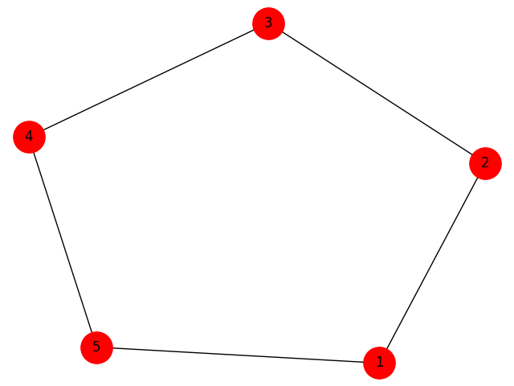

## Grafos - Ciclo Euleriano

### Integrantes do projeto:

* [Felipe Nathan Welter](https://github.com/felipenwelter)
* [Vitor Emanuel Batista](https://github.com/vitorebatista)

### Algoritmos implementados

#### import_file

Importa um arquivo .graph com a estrutura de um grafo. Na primeira linha devem estar descritos todos os vértices, separados por vírgula e, a cada linha que segue, uma aresta configurada pela definição dos seus dois vértices (não direcionado).

*Complexidade da implementação: O(|A|) + O(|A|) sendo A o número de arestas do grafo. A função percorre todas as arestas definidas no arquivo .graph e ao final executa a chamada da função __create_adjacency_list() que percorre todas as arestas para montar uma lista de adjacências.*

### is_connected

Tem por objetivo verificar se todos os vértices estão conectados, premissa para identificar a existência de um ciclo euleriano. Internamente realiza uma busca em profundidade (__depth_search) e vai marcando cada vértice como visitado. Ao final realiza uma contagem de vértices não visitados para identificar se o grafo é conexo.

*Complexidade da implementação (__depth_search): O(|vˆ3|) sendo v o número de vértices do grafo. A função realiza uma busca em profundidade (__depth_search) que percorre para cada vértice a sua lista de adjacências - uma vez no sentido v1 para v2 e outra no sentido v2 para v1, o que tem complexidade O(|A|), que no pior caso se aproxima de O(|vˆ2|) caso todos os vértices estejam interligados. Para cada iteração realiza ainda uma busca na lista de vértices visitados, uma lista que tem o mesmo tamanho do número de vértices, resultando em uma complexidade O(|vˆ2|) * O(|v|) = O(|vˆ3|).*

*Complexidade da implementação (is_connected): O(|vˆ3|) + O(|v|) sendo v o número de vértices do grafo. Realiza a busca em profundidade e uma busca por vértices não visitados com complexidade O(|v|).*

### is_all_pair

Verifica se o vértices tem grau par, ou seja, se o número de arestas de cada vértice é par, sendo esse um requisito para identificar se o grafo possui ciclo euleriano.

*Complexidade da implementação: Para cada vértice identifica o tamanho da lista de adjacências e verifica o módulo dois para identificar se é ou não par, portanto tem complexidade relativa ao número de vértices O(|v|).*

### euler_cycle


## Classes Utilizadas

* Class Arquivo

Dentro dessa classe, encontra-se as funções responsaveis por abrir, ler e gravar em cada variavel os dados contidos no arquivo de entrada.

É nela que estão localizadas os algoritmos responsáveis por chamar as funções Largura, Profundidade e Dijkstra. 

* Class Grafo

Nessa classe, as funções recebem os dados extraidos na Class Arquivo e calcula a Largura, Profundidade e o menor caminho. 

* Class Main

É a classe responsavel por fazer as validações nos arquivos de entrada e saída e por executar a lista de comandos do arquivo de entrada.

* Class Interface

Responsavel por carregar a interface utilizada no projeto.


## Installation
Make sure you have [Pipenv](https://github.com/pypa/pipenv#installation) and execute:
```shell
$ pipenv install 
```

## Usage

```shell
$ pipenv shell
$ python main.py
```

## Idea of the algorithm
The basic idea of Hierholzer's algorithm is the stepwise construction of the Eulerian cycle by connecting dijunctive circles. It starts with a random node and then follows an arbitrary unvisited edge to a neighbour. This step is repeated until one returns to the starting node. This yields a first circle in the graph. If this circle covers all nodes it is an Eulerian cycle and the algorithm is finished. Otherwise, one chooses another node among the cycles' nodes with unvisited edges and constructs another circle, called subtour. By choice of edges in the construction the new circle does not contain any edge of the first circle, both are disjunct. However, both circles must intersect in at least one node by choice of the starting node of the second circle. Therefore one can represent both circles as one new circle. To do so, one iterates the nodes of the first circle and replaces the subtour's starting node by the complete node sequence of the subtour. Thus, one inegrates additional circles into the first circle. If the extended cycle does include all edges the algorithm is finished. Otherwise, we can find another cycle to include.

In the case of an undirected, semi-Eulerian graph the algorithm starts with one of the two nodes with odd degree. In the directed case with the node with one additional outgoing edge. One of the subtours to be found will then not form a cycle, instead it will also be a path. When integrating this "subtour" into the circle one has to make sure that start and end node of this path also form start and end of the complete Eulerian path.

## Prints




## Contributing
PRs are welcome, if you have any questions don't be afraid to open an issue.
